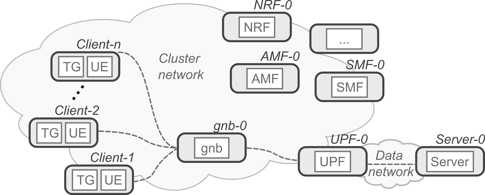

# A Cloud-Native 5G Testbed (cn5gt) for investigating cyber-threats

This projects provides a Kubernetes application for quick and easy setup of cloud-native 5G testbeds. The current target is mostly represented by network attacks, but the general structure can be easily extended to cope with other use cases.


# Quick start

This is a quick how for those who already know the application purpose and structure (see [below](https://github.com/mattereppe/cloud-native-5g-testbed#overview-of-the-application)). Also disable anti-spoofing filters if the cluster is hosted in the cloud, as described for [OpenStack](https://github.com/mattereppe/cloud-native-5g-testbed/blob/main/docs/kubernetes-setup.md#openstack-configuration).

- Clone the repository and enter it.
```
git clone https://github.com/mattereppe/cloud-native-5g-testbed.git
```

- Edit the main configuration and change the values according to your environment:
```
vim config/cn5t.env
```
- Build the configuration and deploy it:
```
make run
```
- Once done, you can remove the application with:
```
make delete
```
- If you want to clean the automatically-generatd manifest files:
```
make clean
```

# Overview of the application

The Cloud-Native 5G Testbed application is a template to build different use cases based on 5G networking. The template includes a 5G Core (5GC), one Radio Access Network (RAN), one Internet server and many mobile users, as shown in the Picture below.

<picture>
  
</picture>

Mobile clients combine 5G User Equipment (UE) with client software for the Internet server. This also includes malicious software to perform attacks against the same server. By selecting different services and malware it is possible to build a number of use-cases. The current release provides a simple HTTP use-case with goldeneye attack.


# Full documentation

Instructions to setup a Kubernetes cluster suitable for this application can be found [here](docs/kubernetes-setup.md).

A more detailed overview of the setup process and configuration options available can be found [here](docs/install.md).

Bugs, limitations, and troubleshooting are available [here](docs/bugs.md).


# License

All templates, scripts, source code and related files including the documentation are  made available under the terms of the GNU Affero General Public License (GNU AGPL v3.0), unless otherwise stated at the beginning of each file.

Running the testbed entails the usage of Docker images. As with all Docker images, these contain other software which may be under different licenses. The list of third parties' software is available in the [repo-info](repo-info/) directory of this project.
As for any pre-built image usage, it is the image user's responsibility to ensure that any use of this image complies with any relevant licenses for all software contained within.

# Acknowledgement

You can freely use templates and software available from this repos. However, if you use it for your scientific papers, please reference the following paper:

<i>M. Repetto. Service Templates to Emulate Network Attacks in Cloud-Native 5G Infrastructures. 5th International Workshop on Cyber-Security Threats, Trust and Privacy Management in Software-defined and Virtualized Infrastructures (SecSoft), June 23rd, 2023, Madrid, Spain.</i>

