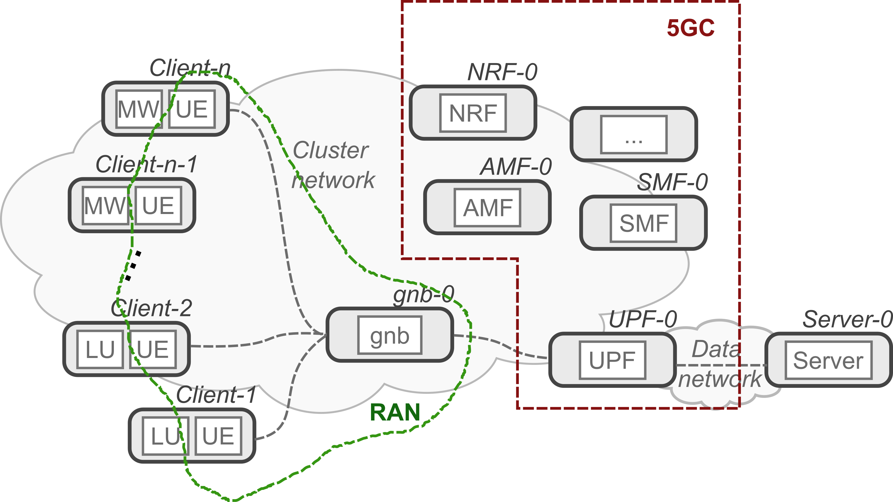
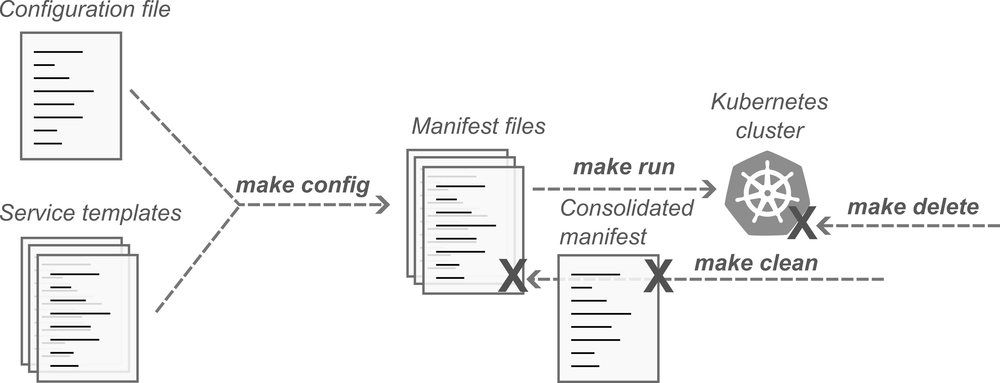

# Install the 5G Kubernetes application

This guide describes the full process for setting up a working instance of the 5G application, including its use-cases.


# Prerequisites

The main prerequisite to run the testbed is a Kubernetes installation. If you haven't got a cluster, you can follow the instructions [here](https://github.com/mattereppe/cloud-native-5g-testbed/blob/main/docs/kubernetes-setup.md#installing-a-kubernetes-cluster).

There are a few conditions for the setup to work correctly:
- all Kubernetes nodes must have an interface with the same name connected to the same network (typically the cluster network, but it could also be an additional network);
- an NFS server for exporting a folder to all nodes (default: /srv/mongodb);
- envsubst installed in your building machine;
- flannel CNI for the cluster network; other CNIs might work but have not been tested yet.

# Getting the software

The necessary software can be retrieved by cloning this repository:
```
git clone https://github.com/mattereppe/cloud-native-5g-testbed.git
```

This creates a copy of the necessary file to implement the configuration and management workflows; docker images are not copied locally, but are directly downloaded at deployment stage. 

As part of the whole project, the Dockerfiles for building software images are available in the ```docker``` folder. If you want to make changes and run your own version, you must create your own workflow for that and modify the configuration accordingly. Image names are the same as the folder where each Dockerfile is located.

# Application description

The cn5gt application emulates network attacks in (and against) 5G infrastructures. It therefore deploys the following components:
- a 5G Core (5GC): ```Open5GS```;
- a Radio Access Network (RAN) segment (UE+gnb): ```UERANSIM```;
- an Internet server;
- mobile licit users (LU) accessing the Internet service; 
- a botnet where malware (MW) generates attacks against the Internet service (or the 5G infrastructure).
  
<picture>
  
</picture>

## 5G network

The 5G network includes the 5GC and one RAN. 

The 5GC is configured with a private MCC/MNC pair and without network slices. Traffic from all UE is delivered to the same UPF/Data Network. The network used for the tunnel between UE and UPF is 10.45.0.0/16, and it currently cannot be changed by configuration. 

Most of the pods of the application are connected to the main cluster network. However, the 5G Data Network (DN) requires a different addressing scheme, and therefore an additional network is created with ```multus```. Both the UPF and the Internet server have interfaces on the DN.

The RAN consists of a single gNobeB, to which all mobile UE connect. Both gNobeB and UE share the cluster network, which is not a problem since this is only an emulation of a real system. 

A database with 200 users is provided. It can be loaded by setting the ```INIT_MONGODB=1``` (see (below)[]). Such users are generated with an incremental IMSI, from 0000000001 to 0000000100 and from 1000000001 to 1000000100. 
They share all other parameters, including encryption/integrity keys and IMEI, since these are not relevant to the purpose of the application.
IMSIs with the first digit set to "0" are used for licit users, whereas those starting with "1" are assigned to malicious users. The IMSI of each user can be easily inferred by its pod number, by summing "1" and "1000000001" for licit and malicious terminals, respectively. This approach facilitates the assignment of IMSIs when scaling the number of users, and does not have significant implications on the realisticity of the system.

## Use case: Goldeneye DDoS

The current release provides a simple DDoS attacks against an HTTP server, with the following configuration:

- Licit Users: HTTP clients emulated by simple ```curl``` scripts;
- Server: ```httpbin```; 
- Malware: 	```goldeneye``` DDoS attack.


# Workflow description

The main purpose for cn5gt is to serve as a template for multiple use-cases that want to investigate the impact of network attacks in real-word applications in 5G systems. The primary motivation is the need to emulate variable workloads, in presence of a different number of users, as well as to replace both Internet services/clients and malware. The scope also includes adaptability to different Kubernetes environments, which use different domain names, addressing schemes, service configurations, and hardware interfaces.

To overcome the static nature of Kubernetes manifest files, a ``templating'' mechanism is used that generates manifest files at run-time by replacing  parameters (e.g., docker image name/tag, number of replicas, service labels, cluster resources) in general templates. Althought better or more elegant solutions exist for this purpose (e.g., Helm), a more legacy approach has been used here, based on Makefile. It allows to use simpler key/value syntax in the configuration files, which is more confortable for most users without deep cloud skills. 


<picture>
  
</picture>

# Configuration

Configuration options are set in ```config/cn5t.env```.

## Main application

The following configuration options are available to tailor the deployment to different Kubernetes environments.
- ```IMAGE_REPO```: sets the repository to download docker images. It defaults to the repository of this project, but users might select their own repository if they want to modify Dockerfiles and build their own images.
- ```CN5T_RELEASE```: selects the release version of docker images to be used for the deployment. Default to last stable release (selection of ```main``` is discouraged because these images are usually used for testing).
- ```K8S_NAMESPACE```: selects a namespace to deploy the application. It is recommended to use a separate namespace for different deployments and use-cases.
- ```K8S_DOMAIN```: the cluster DNS domain. Must be set to the correct value for the current Kubernetes installation.
- ```NFS_SERVER```: the address of an NFS servers available to Kubernetes nodes. It is used for persistent storage whenever necessary.
- ```NFS_SERVER_MONGODB```: a share exported by the NFS server for storing mongodb files. Must be exclusively reserved to the cn5gt and not shared with other database instances.
- ```INIT_MONGODB```: sets the initialization mode. A value of ```0``` means existing database files are used, as found in the NFS share. A value of ```1``` means a new database is created, with 200 users available (100 for licit users, 100 for malware). The db should be initialized the first time the application is deployed, then it could be safely set to ```0```.
- ```NETIFACE1```: sets the name of the network interface of worker nodes that will be used to create the DN. The DN is a virtual network, so this interface can be the same of the cluster network. If any other interface is used, there must be a working network configured for it. Note the all Kubernetes node must have an interface with this name (an alias must be defined in this condition is not met).
- ```DATANETWORK1```: sets the network address to be used for the data network. It must not overlap with the cluster network or any other local network, unless the latter is used to connect with external hosts and systems (e.g., the public Internet or another testbed).
- ```ADDR_UEGW```: selects the address that will be assigned to the UPF interface  on the DN. It will be the default gateway for all UEs served by that UPF.
- ```ADDR_VICTIM```: sets the address that will be assigned to the Internet server (aka the ``victim''). Must be within the range of the DN.

Note that addresses to UE will be assigned automatically by the 5GC. Static addresses for the UPF and the Internet server are necessary because there is not currently a simple way to integrate this address space in Kubernetes DNS.

## Use Cases

The DDoS use-case have the following configuration parameters:
- ```CURL_REPLICAS```: number of licit users (HTTP clients). 
- ```CURL_DELAY```: The delay (in seconds) between each group of queries to the HTTP server from licit users. Each group of queries consists in the requests for all possible endpoints exposed by the ```httpbin``` server.
- ```CURL_TIMEOUT```: The timeout for each ```curl``` query. It is usually due to connectivity problem (when the UE is not connected to the 5GC) or unresponsiveness of the server (e.g., during the attack).
- ```DDOS_REPLICAS```: number of malicious users (attackers).
- ```GOLDENEYE_URL```: The base URL of the victim server. For the current implementation, this is automatically derived from the victim's IP address.
- ```GOLDENEYE_WORKERS```: Number of concurrent workers (see the ```goldeneye``` [documentation](https://github.com/jseidl/GoldenEye#usage)).
- ```GOLDENEYE_SOCKETS```: Number of concurrent sockets (see the ```goldeneye``` [documentation](https://github.com/jseidl/GoldenEye#usage)).
- ```GOLDENEYE_METHOD```: HTTP Method to use 'get' or 'post'  or 'random' [documentation](https://github.com/jseidl/GoldenEye#usage)).

The parameters ```CURL_REPLICA``` and ```DDOS_REPLICAS``` cannot exceed 100 if the included database of mobile users is used. Larger values require to build larger user databases.

# Build and run the application

After configuration, the first step is the creation of the Kubernetes manifest files for deployment:
```
make config
```
This command replaces configuration variables in templates and creates the corresponding Kubernetes manifest files in the ```deploy``` folder.

An additional step is the creation of a single manifest for the entire application, where all previous files are merged:
```
make all 
```
(This step of course generates all intermediary manifest files if missing, or if the corresponding templates have changed.)


The deployment is triggered with the following command:
```
make run
```
which also implies all previous steps in case something is missing or outdated. It is possible to make changes to individual manifest files, e.g., for debugging and troubleshooting, without altering the original templates. Be aware that every time templates are modified, any of the previous commands will override manual changes to deployment manifests.

Finally, the application can be removed from the cluster with:
```
make delete
```
and all manifest files can be purged with:
```
make clean
```

# Building additional use cases

Advanced users can build additional use cases, by replacing the container images for the Internet service, licit clients, and botnet.
The DDoS use case can serve as a reference template for this purpose.

## Directory structure

The ```template``` folder is already organized to facilitate the development of additional use-cases:
- The ```config``` folder contains configuration files. They are organized in further subfolders, which name starts with a two-digit number to maintain the order they should be created. Use cases should follow this convention and be numbered as 5x, 6x, ....
- The ```network``` folder contains the application templates for network components, namely the 5GC, RAN and their dependencies (i.e., the database). The same numbering convention is used as for the ```config``` folder, and the same numbers are used for the sake of simplicity.
- The ```usecases``` folder contains the application templates for use cases. Each use case should provide the definition of the pods for mobile users and the Internet servers. Likely, there will always be two kinds of mobile users, namely licit and malicious terminals.

## Add new use case

By replacing the docker images for mobile clients, the Internet server, and the malware it is possible to implement different use cases. 
The easiest way is probably to copy an existing use-case, rename its folder and change the yaml files. The yaml file for an Internet server could be replaced entirely; yaml files for mobile clients must only replace the init container and the application-specific pod.

## Ignore templates

If a template must be ignored during the build/deployment process, it must be renamed with a suffix other than "yaml". For instance, add an "_" or any other letter/character.

## Disable use-case

If en entire use-case must be disabled (i.e., not deployed), its folder must be renamed so that it does not start with a digit. For instance, ```51_goldeneye``` could be renamed ```goldeneye```.

## Changing network configuration

Network configurations are a bit more trickly to change, because they required deep understanding of 5G concepts and Open5GS/UERANSIM software. Simple configurations can be done by working on the files under the ```config``` folder, but more complex configurations (e.g., multiple data networks, multiple RANs) need to revise the application templates.


## Patches and extensions

In case of changes to software images, please consider that some patches are applied to automatically build the cn5gt application.

### UERANSIM software

The current UERANSIM implementation has two major issues regarding the integration with the 5GC. 

First, there is no way to configure a route to the remote DN; tunneling to the DN is only possible by binding to the corresponding interface, but this option is rarely available for software tools that may be used as TG. 
The UERANSIM docker image includes a patch that sets up a route to the DN. This patch is available in the ```docker``` folder.

Second, UERANSIM is not designed as cloud-native application, and this means it hangs when the AMF is restarted for some reason.
In this case, a liveness probes is present in the templates for both the gNodeB and the UE. For gNodeB, the probe checks whether the registration to the AMF is present. For the UE, it checks whether the tunnel interface is available. In case of errors, the pod is restarted.

### Goldeneye software

The goldeneye implementation is not conceived as cloud-native. It has long timeouts in case of broken connectivity, and it does not automatically restart in case of errors. In this case that patch adds a specific exit value to the application, which is used to detect connection failures. Additionally, a liveness probe is present that checks whether the tunnel to the UPF is present or not.

The patch can be retrieved [here](https://github.com/mattereppe/goldeneye). 

